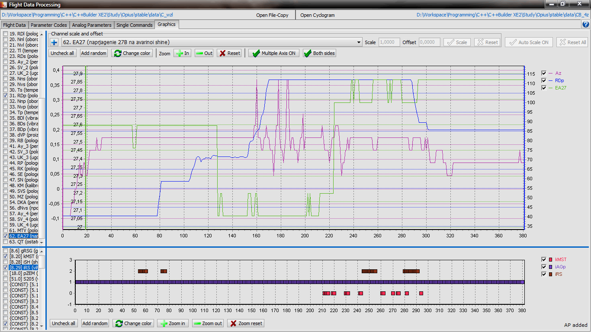
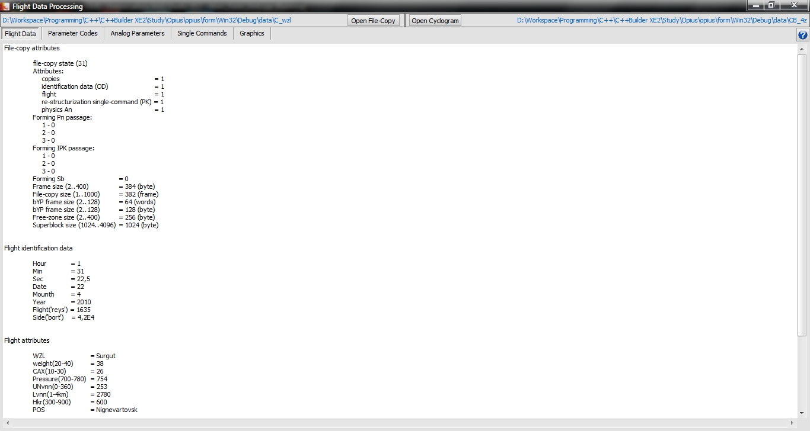
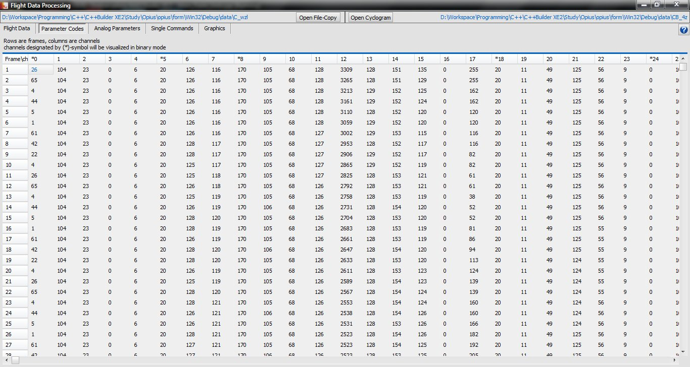
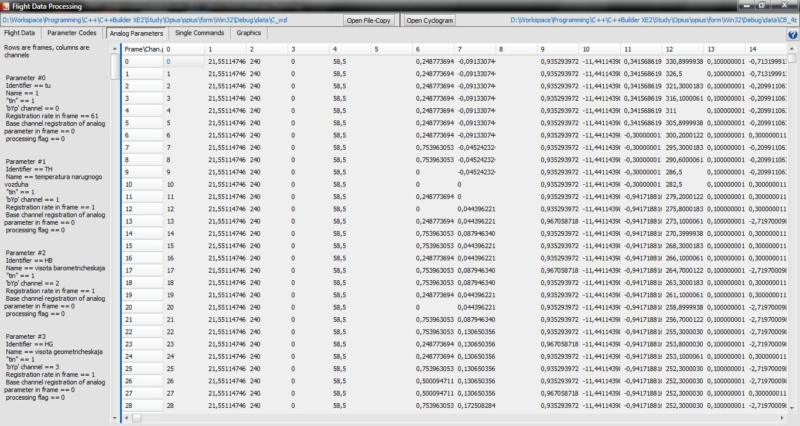
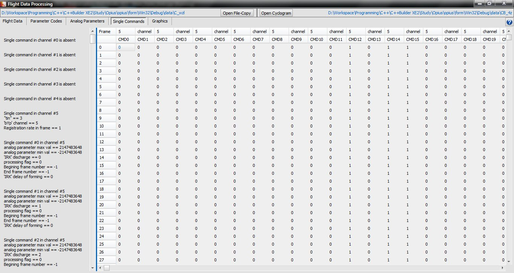

# Flight-Data-Processing
Flight data processing application for Windows build with C++ and RAD Studio, with Graphical User Interface.
The project was started at the university under the guidance of senior lecturer. Program visualizes analog flight parameters and builds plots. Incoming data are binary files with the parameters read from the flight recorder.

*version 1.2*

**Authors:**

Alexander Sergeyevich Ostapenko,
Senior lecturer in the Insitute of Computer Information Technology:

*Console Flight Data Processing functions library.*

Belyak Vitaliy Y.,
Skavulyak Dmitry O.,
Students of the Institute of Computer Information Technologies:

*Graphical User Interface.*

National Aviation University, 2015

--------------------------

--------------------------

[Manual (RU)](data/FDP_help.pdf)
